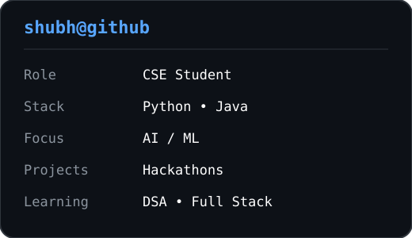

<h3><code>shubh@github ~ $ ./contributions.sh</code></h3>

<h2>shubh@github ~ $ ./contributions.sh</h2>

  

<h3><code>shubh@github ~ $ whoami</code></h3>

<h2>shubh@github ~ $ whoami</h2>

<table>
<tr>

<td valign="top">

</td>

<td valign="top">

</td>

</tr>
</table>

<<<<<<< HEAD

=======

>>>>>>> 0603986 (Create animated GitHub profile)
